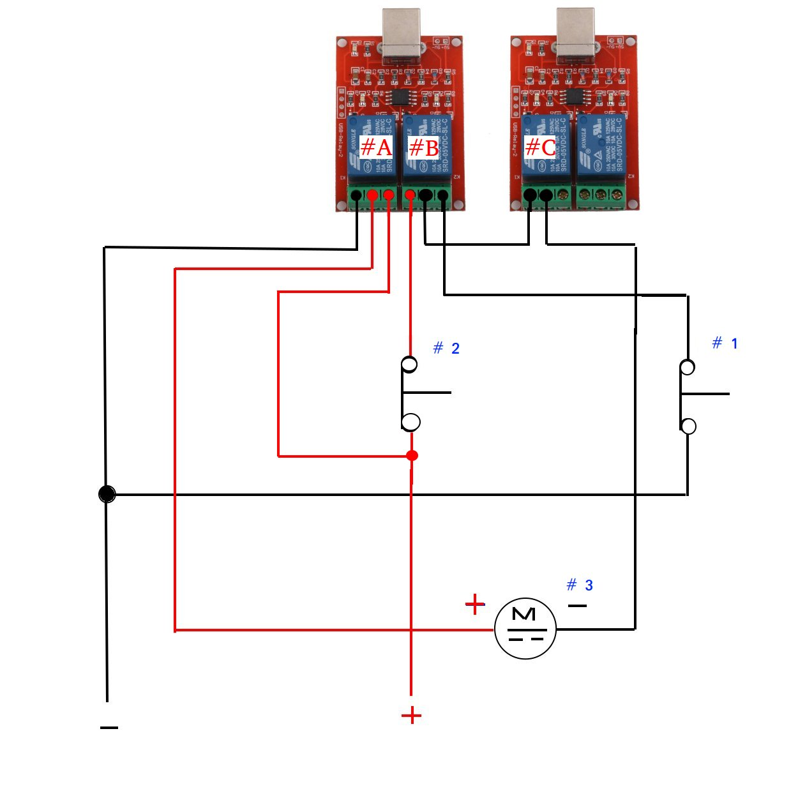
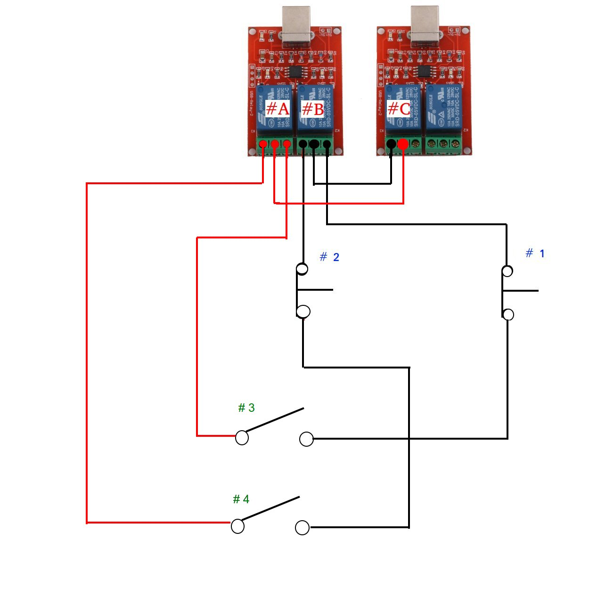
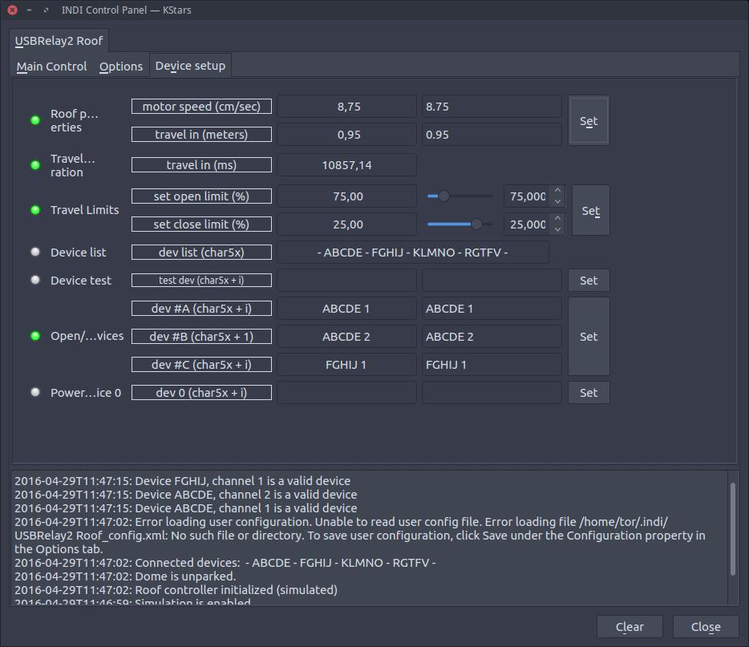
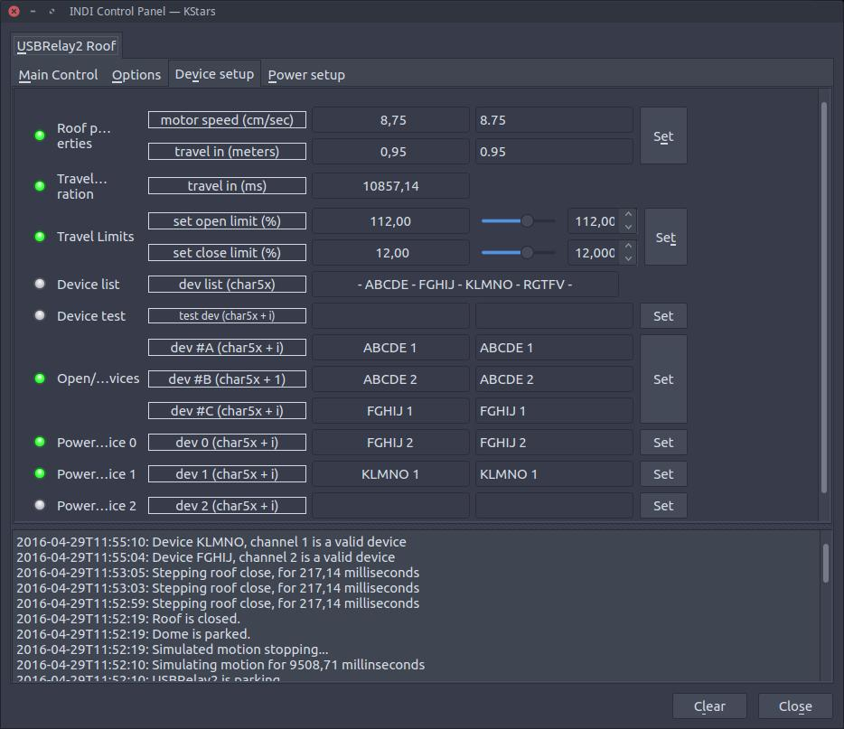
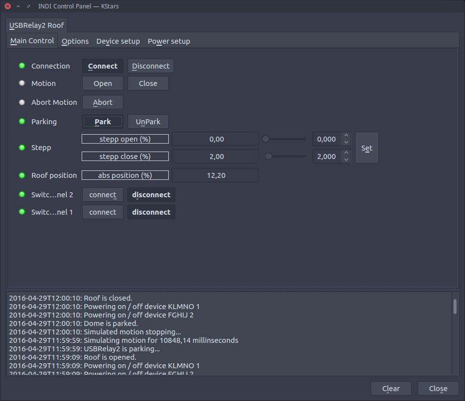
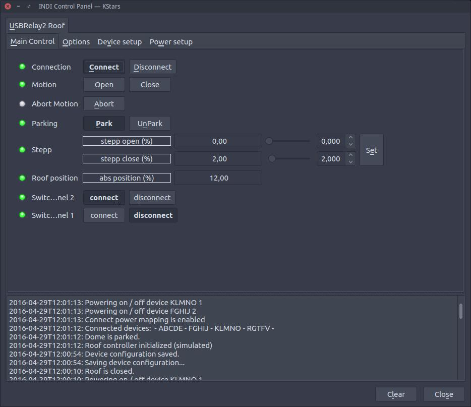

### INDI USBRelay2 Roof

#### Summary
INDI USBRelay2 Roof is a Dome driver compatible with INDI Control Panel and INDI clients. (Tested only with EKOS in KStars)
The project has been compiled and tested on Linux (Ubuntu) x86_64, Linux (Lubuntu) armv7l (ODROID C1+), Linux (Raspbian) arm (Raspberry PI 1 model B).
The "driver" uses the usb-relay-hid API to enable remote controlling of usbrelay devices, as roof controller and power switches. 

To open and close roof three relay channels are used, #A, #B and #C. Channels #A and #B uses the normally open (NO) and normally closed (NC) layout of the relay channels, to flip the positive and negative phase. Channel #C acts as a single phase switch to the DC motor, to start and stop roof motion. It is possible to calibrate the roof travel with motor speed, roof travel and travel limits, but it is advisable to also have physical cut off switches in the fully opened and fully closed position to avoid binding. On the sketch below, #1 is a push-off fully opened limit switch, that limits roof opening further than a set limit. #2 is a push-off fully closed limit switch.

You can also use a garage door opener or similar controller. Just override the open = #3 button, and close = #4 button.

DC motor style connection


Garage door style connection


In INDI USBRelay2 Roof >= v0.3 both 1, 2, 4 and 8 channel devices is supported, and they are all resonably prized on [Ebay](http://www.ebay.com/sch/i.html?_odkw=5v+usb+relay+programmable+compute+controll&_osacat=0&_from=R40&_trksid=p2045573.m570.l1313.TR0.TRC0.H0.X5v+usb+relay+programmable+computer+controll.TRS0&_nkw=5v+usb+relay+programmable+computer+controll&_sacat=0), or
[AliExpress](http://www.aliexpress.com/wholesale?catId=0&initiative_id=SB_20160504000929&SearchText=5v+usb+relay+programmable+computer+controll).
Note that it is the RED version that is supported and not the blue. For more info see [usb-relay-hid](https://github.com/pavel-a/usb-relay-hid), and the included links

When power devices is added, you can power channels on and off in the Main Control tab. You also get a power tab that allows you to map the on and off states for all channels, when connecting, when parking, and when unparking the roof. The power switches in the Main tab will always be updated and reflect the actual state of the channel.

It's also worth noting that the 1 and 2 channel boards has a "optional" -5v +5v input. This allows the device to remember channel states when the server reeboots or is powered off. The 4 and 8 channel devices must have a 12v powersupply connected to the -12v +12v input.

INID USBRelay2 Roof does support simulation. You can compile it and see that it works on your system before considering getting the devices. Just enable simulation in the Options tab before connecting.


<br>
#### Known issues
* At the moment the function 'USBInterface::GetDevices()' that calls the 'USBRL_API::usb_relay_device_enumerate()' never returns the info for more than two devices. This makes the device list in Device setup tab incomplete.
* If Open or Close is aborted using the 'Abort' button, the switch status will not reset. This means that if aborting 'Open/Close' the 'Open/Close' button must be klicked twice to resume 'Open/Close'. This does not happend when Parking or Unparking, nor if 'Open/Close' is aborted with a second klick on 'Open/Close'. Aborting Open and resuming to Close works as expexted, and vice versa

<br>
#### Attributions
* This project could not be done without the existing libindi project or the usb-relay-hid API.
* This project is 3rd party and dependent on the mentioned projects, and licensed accordingly. See LICENSE, COPYING.GPL and COPYING.BSD.
* Some files have additional lisence information, see file headers.

<br>
#### Installing dependencies
##### libindi and it's dependencies
* To build libindi from source [see instructions on indilib.org](http://www.indilib.org/forum/general/210-howto-building-latest-libindi-ekos.html)

##### libusb_relay_device.so [usb_relay_hid], and it's dependencies
```
mkdir ~/Projects
cd ~/Projects
git clone https://github.com/pavel-a/usb-relay-hid.git
cd usb-relay-hid/commandline/makemake/
sudo apt-get install libusb-dev
make
sudo cp usb_relay_device.so /usr/local/lib/libusb_relay_device.so
cd ../../lib/
sudo cp usb_relay_device.h /usr/local/include/usb_relay_device.h
echo "/usr/local/lib" | sudo tee /etc/ld.so.conf.d/usr_local_lib.conf
sudo ldconfig
```

<br>
#### Install INDI USBRelay2 Roof
```
cd ~/Projects
git clone https://github.com/magnue/indi_usbrelay2_roof.git
cd indi_usbrelay2_roof
mkdir build
cd build
cmake -DCMAKE_INSTALL_PREFIX=/usr . ..
sudo make install
```
#### Update
```
cd ~/Projects/indi_usbrelay2_roof/
git pull
cd build
sudo make install
```

<br>
#### Example of use

##### connect and calibrate roof
* Connect.. The driver will assume the roof is closed (parked) when connecting the first time.


* Enter the #A, #B, and #C channel. 
* Use the device test to see whitch physical device belongs to the device strings(s). The device test will turn one channel on for 1.5 sec and off again. Take a note of the result for future reference.
* Set the motor speed (cm/sec) and roof travel (meters). This wil calculate the total travel in milliseconds.
* For first run set the open limit to 75%, and close limit to 25%. this will make the roof not fully open and close.



* Unpark the roof so it opens to 75%
* Use the stepp open (%) to fully open the roof, and note the abs position (as this will be your open limit)


* Park the roof so it will close to 25%
* Use stepp close to find the abs position for fully closed position.


* Set your calibrated travel limits in Device Setup.

##### connect and set power devices
* You can also add one or more (max 10) power channels. In this example i added two.
* Note tat there is now a Power Setup tab



* The Power Setup tab can be used to set the desired states for connection, parking and unparking. Default is leave everything as is.


* In my case my mount supports hibernation and will be powered off when disconnected.
* In that case set the channel that powers on your mount, to power on when connecting.
* I have everything to power off when parking, and everything to power on when unparking.
* Depending on your needs all of this might need other settings.


* As we added a power device we now have manual power switches on the Main Control tab, that can be used for manual power control.
* The status of these switches will always be updated when connecting, unparking and parking.
* The difference between the open, close (Motion) and the park, unpark (Parking) switches is that the (Motion) switches will not initiate the Power mapping.


* Roof unparked and all channels on..


* Roof parked and all channels off..



* Roof disconnected, reconnected and channel one is powered on..


